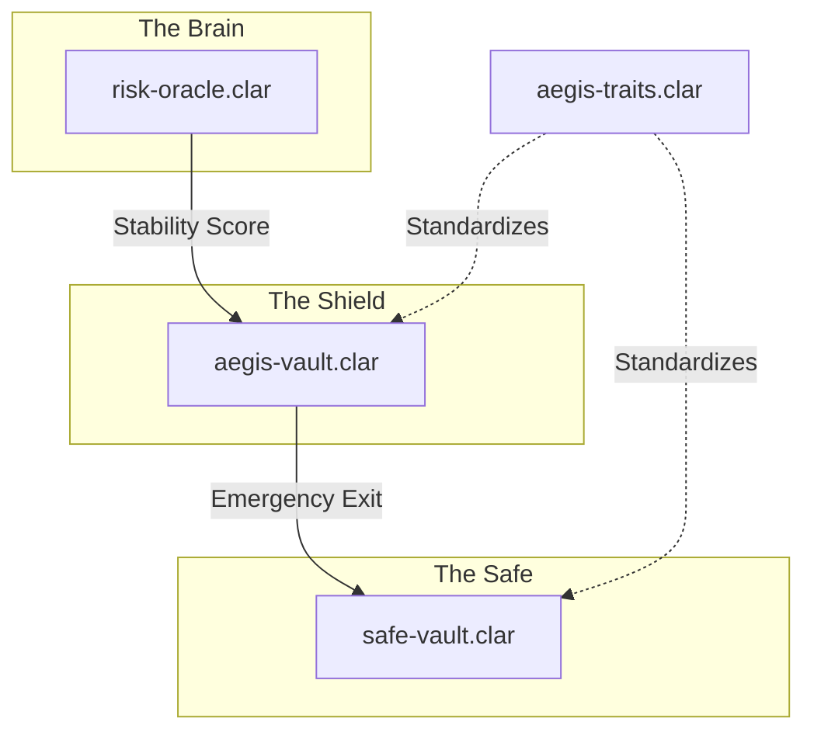
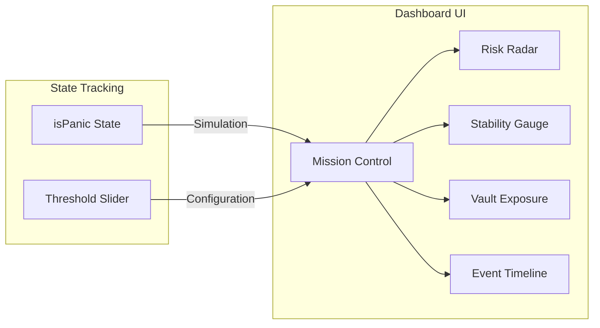

# Stacks Aegis: Technical Architecture & Interconnections

Stacks Aegis is an institutional-grade security layer for the Stacks DeFi ecosystem. This document outlines how the various components—from Clarity smart contracts to the React dashboard—interconnect to provide automated protection for digital assets.

## System Overview

The system is designed with a "Sense-Think-Act" architecture:
1.  **Sense**: The **Risk Oracle** monitors market conditions.
2.  **Think**: The **Aegis Vault** evaluates oracle data against user-defined thresholds.
3.  **Act**: The **Circuit Breaker** triggers automated withdrawals to a **Safe Vault** if stability is compromised.

---

## 1. Smart Contract Layer (The Core)

The backend logic resides in the `contracts/` directory, written in Clarity.

### [risk-oracle.clar](file:///home/ebendttl/Stacks-Aegis/stacks-aegis/contracts/risk-oracle.clar)
*   **Role**: Aggregates price deviation, liquidity depth, and volatility data.
*   **Interconnection**: Provides the `get-stability-score` function used by the vault to decide when to panic.

### [aegis-vault.clar](file:///home/ebendttl/Stacks-Aegis/stacks-aegis/contracts/aegis-vault.clar)
*   **Role**: The primary interface for user deposits. It implements the "Shield" logic.
*   **Interconnection**: Executes `evaluate-and-trigger`. If the score < `PANIC-THRESHOLD`, it sets `circuit-breaker-active` to true and pulls funds out of high-risk protocols.

### [safe-vault.clar](file:///home/ebendttl/Stacks-Aegis/stacks-aegis/contracts/safe-vault.clar)
*   **Role**: A minimal-risk destination for capital during market turbulence.
*   **Interconnection**: Receives funds routed via `emergency-exit` from the protected vaults.

---

## 2. Frontend Layer (Mission Control)

The dashboard provides a real-time command center for the protocol.

### [MissionControl.tsx](file:///home/ebendttl/Stacks-Aegis/stacks-aegis/dashboard/src/modules/dashboard/MissionControl.tsx)
*   **Role**: Orchestrates the entire UI. It manages the `isPanic` simulation state and the `threshold` configuration.
*   **Interconnection**: When `isPanic` is toggled, it triggers conditional rendering across the `StabilityScoreGauge` and `EventTimeline`, simulating a blockchain event.

### [RiskRadar.tsx](file:///home/ebendttl/Stacks-Aegis/stacks-aegis/dashboard/src/modules/risk/RiskRadar.tsx)
*   **Role**: Displays health status of various Stacks protocols (Bitflow, Zest, etc.).
*   **Interconnection**: In a production environment, this would map directly to `get-vault-liquidity` calls on external protocol contracts.

---

## 3. The Interconnection Flow

How a "Stacks Aegis Reality" is achieved:

1.  **Configuration**: User sets a threshold (e.g., 98/100) via the **Mission Control** slider.
2.  **Monitoring**: The **Risk Oracle** constantly updates the stability score on-chain.
3.  **Detection**: If the score drops below 98, **Aegis Vault** detects this during its next evaluation.
4.  **Reaction**: The vault automatically triggers the **Circuit Breaker**.
5.  **Feedback**: The **Dashboard** (reacting to its own internal state or a blockchain websocket) switches to **Emergency Mode**, showing the **Event Timeline** as funds move to safety.

## 4. Design Aesthetics
The project uses a **Fintech Neobrutalism** design system:
- High contrast colors (Black, White, Stacks Orange).
- Sharp edges and heavy "brutal" shadows.
- Monospace typefaces for financial data to convey precision and transparency.
